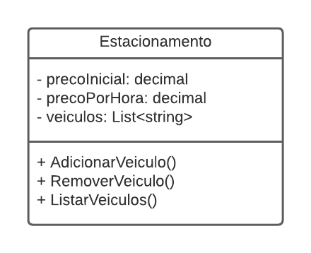

# 🚗 Sistema de Estacionamento em .NET - Fundamentos

Este repositório corresponde ao Desafio #01 da [Bootcamp Decola Tech 2024](https://web.dio.me/track/decola-tech-avanade-net-developer) para criar um sistema de console em `.NET` e `C#` para gerenciar veículos estacionados, aplicando conceitos básicos de programação, como classes, listas, métodos e interação com o usuário.

## Índice
- [Introdução]()
- [Tecnologias Utilizadas]()
- [Desafio de Projeto]()
- [Objetivos]()
  - [x] Pré-requisitos
  - [x] Estrutura do Projeto
  - [x] Regras e Validações
  - [x] Especificações de Conteúdo
  - [x] Especificações Técnicas
- [Planejamento do Projeto]()
- [Passo a Passo]()
- [Modelo do Diagrama]()
- [Execução do Projeto]()
- [Créditos]()
- [Autora]()

### ▶️ Introdução
O sistema de estacionamento foi desenvolvido em `C#` e `.NET` como primeiro desafio da trilha de Fundamentos. Ele permite cadastrar, remover e listar veículos estacionados, além de calcular o valor devido com base no tempo de permanência. Na proposta desafio o desenvoledor foi contratado para construir um Sistema para um Estacionamento, que será usado para gerenciar os veículos estacionados e realizar suas operações, como por exemplo adicionar um veículo, remover um veículo (e exibir o valor cobrado durante o período) e listar os veículos.

### 💻 Tecnologias Utilizadas

| Linguagens de Programação | Ferramentas e Tecnologias |
| :-----------------: | :-----------------------: |
|    | 

### 🎯 Desafio de Projeto
- Criar uma classe Estacionamento com atributos e métodos para gerenciar veículos.
- Implementar menu interativo no console.
- Calcular o valor de estadia com base em preço inicial e valor por hora.

### 🛠️ Objetivos
O objetivo foi aplicar fundamentos básicos de programação:
- Classes e objetos
- Listas (List<T>)
- Métodos
- Estruturas condicionais e de repetição

Por último, deverá ser feito um menu interativo com as seguintes ações implementadas:
1. Cadastrar veículo
2. Remover veículo
3. Listar veículos
4. Encerrar

**📌 Pré-requisitos**
1. Ter o [.NET 6.0](https://dotnet.microsoft.com/pt-br/download/dotnet/6.0) instalado.
2. Ter o [Node.js](https://www.nodejs.tech/pt-br/download) instalado.
3. Editor de código [Visual Studio](https://visualstudio.microsoft.com/pt-br/) ou [VS Code](https://code.visualstudio.com/).

**📂 Estrutura do Projeto**
```
Estacionamento/
│
├── 📁 Models
│   ├── Cliente.cs
│   ├── Veiculo.cs
│   └── Estacionamento.cs
│
├── 📁 Diagrams
│   └── diagrama_classe_estacionamento.png
│
├── 📄 Program.cs
├── 📄 Estacionamento.csproj
└── 📄 README.md
```

**📜 Regras e Validações**
1. Indique um nome para seu negócio.
2. Sua composição de estacionamento (cadastrar, remover, listar e encerrar).
3. Armazenar veículos cadastrados em uma lista.
4. O programa de conter classe e métodos.
5. Calcular valor total ao remover um veículo.
6. Exibir mensagens apropriadas ao usuário.
7. A saída deve exibir a placa do veículo removido e o valor a ser pago.
8. Encerrar o sistema quando desejado.

**📂 Especificações de Conteúdo**
- Classe: `Estacionamento`
- Propriedades:
  - `precoInicial` (decimal)
  - `precoPorHora` (decimal)
  - `veiculos (lista de strings)`
- Métodos:
  - `AdicionarVeiculo()`
  - `RemoverVeiculo()`
  - `ListarVeiculos()`
```
precoInicial: Tipo decimal. É o preço cobrado para deixar seu veículo estacionado.
precoPorHora: Tipo decimal. É o preço por hora que o veículo permanecer estacionado.
veiculos: É uma lista de string, representando uma coleção de veículos estacionados. Contém apenas a placa do veículo.

AdicionarVeiculo: Método responsável por receber uma placa digitada pelo usuário e guardar na variável veiculos.

RemoverVeiculo: Método responsável por verificar se um determinado veículo está estacionado, e caso positivo, irá pedir a quantidade de horas que ele permaneceu no estacionamento. Após isso, realiza o seguinte cálculo: precoInicial * precoPorHora, exibindo para o usuário.

ListarVeiculos: Lista todos os veículos presentes atualmente no estacionamento. Caso não haja nenhum, exibir a mensagem "Não há veículos estacionados".
```

**⚙️ Especificações Técnicas**
- Entrada de dados via console.
- Exibir mensagens apropriadas a cada situação (você tem que interagir com o usuário).
- O usuário tem a opção de não escolher nada e encerrrar o sistema.
- Utilizar decimais e conversores nos itens.
- Uso de `if / else`, `for`, `foreach` e `switch`.
- Cálculo do valor total = `precoInicial + (precoPorHora * horas)`.

### 🚀 Passo a Passo
1. Criar classe Estacionamento com atributos e métodos.
2. Criar menu interativo no console.
3. Implementar lógica de cálculo e listagem.
4. Testar interações no terminal.

### 📊 Modelo do Diagrama
A função do desenvolvedor é dar continuidade obedecendo as regras descritas acima, para que no final, se tenha um programa funcional, conforme o diagrama abaixo:  


### ⏩ Execução do Projeto
1. Clone este repositório.
2. No terminal, navegue até o diretório do projeto.
3. Execute:
```
dotnet run
```

### 🔗 Créditos
Este projeto foi desenvolvido como parte de avaliação de Desafio de Projeto do Decola Tech Avanade 2024, para avaliar o ensinado na bootcamp dos conhecimentos adquiridos no módulo de fundamentos da linguagem de programação `C#`.

*Nota: Este projeto é apenas para fins educacionais e não possui nenhuma afiliação oficial com a franquia DIO ou Avanade ou suas empresas associadas.*

### 👩🏼‍💻 Autora:
<table style="border=0">
  <tr>
    <td align="left">
      <a href="https://github.com/rhayssakramer">
        <span><b>Rhayssa Kramer</b></span>
      </a>
      <br>
      <span>Assoc, Full-Stack Development</span>
    </td>
  </tr>
</table>

<div align="center"><a href="https://github.com/rhayssakramer"></a></div>
